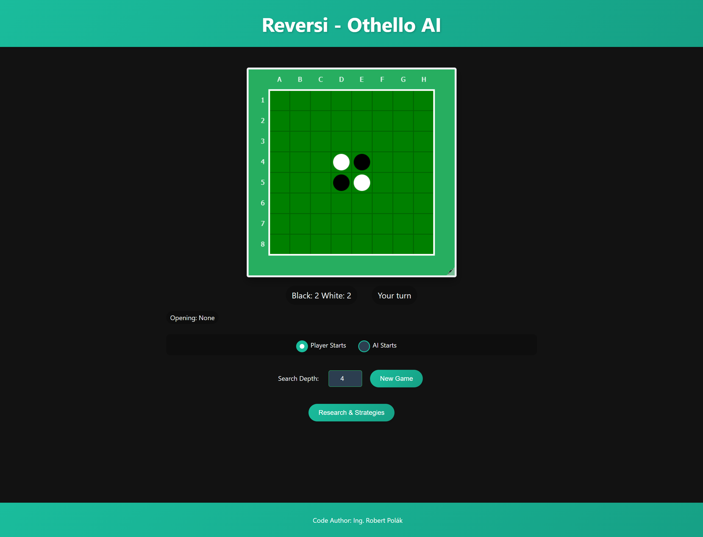

# Reversi AI - Game with Artificial Intelligence

**Code Author:** Ing. Robert Polák

## Project Description

This application is an implementation of the board game Reversi (also known as Othello) using HTML5 Canvas and JavaScript. The game allows you to play against the computer, which uses a combination of an opening book and a heuristic Minimax algorithm with alpha-beta pruning.

## Features

- **Play against the computer:**  
  Test your strategic skills against an AI player.

- **Opening Book:**  
  The AI utilizes a predefined opening book that contains well-known sequences of moves at the start of the game. Board symmetry (rotations by 90°, 180°, 270°) is also taken into account.

- **Heuristic Evaluation:**  
  In the absence of moves in the opening book, the AI switches to a heuristic evaluation of the board positions.

- **Adjustable Search Depth:**  
  The search depth for the Minimax algorithm can be set (from 1 to 10).

- **Intuitive Interface:**  
  A modern and pleasant design for an enhanced gaming experience.

## Installation and Running

1. Clone or download this repository to your computer.
2. Make sure the files `index.html` and `reversi.js` are in the same directory.
3. Open the `index.html` file in your favorite web browser (Chrome or Firefox is recommended).
4. Start playing by clicking on the board and making your first move.

## How to Play

- **You play with the black pieces and start the game.**
- Click on the square where you want to place your piece. Valid moves are highlighted.
- The goal is to have more of your pieces on the board than your opponent by the end of the game.
- The computer will make its move automatically after you.
- You can set the search depth for the AI. A higher value means smarter decisions but longer calculation time.

## Heuristic Used

- **Position Weighting:**  
  Each square on the board is assigned a weight based on its strategic importance. Corners have the highest value, edges a medium value, and inner squares a lower value.

- **Minimax Algorithm:**  
  The AI uses the Minimax algorithm with alpha-beta pruning to predict the best move up to a certain depth.

- **Opening Book:**  
  The AI starts the game using an opening book that contains predefined move sequences. The book also considers board rotations, so the AI can recognize openings even with symmetric positions.

## Customization

- **Adding Custom Openings:**  
  You can modify or add new openings to the book in the `reversi.js` file under the `openingBook` section.

- **Adjusting the Heuristic:**  
  Change the weights in the `POSITION_WEIGHTS` matrix to experiment with different AI strategies.

- **Design:**  
  You can modify the page appearance in the `<style>` section of the `index.html` file.

## Demo

Here you can add screenshots or GIFs of the game for better visualization.

## License

This project is licensed under the MIT License. Details can be found in the `LICENSE` file.

## Contact

If you have any questions or suggestions, you can contact me at: [robopol@gmail.com](mailto:robopol@gmail.com)
